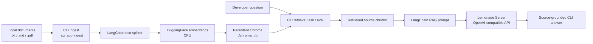

# rag-langchain-ryzen

Small CLI-based local RAG verification project for Windows 11 Ryzen AI MAX.

## What This Project Is

This repository verifies that a minimal local RAG flow works end to end:

- Lemonade Server exposes a local OpenAI-compatible chat model.
- LangChain orchestrates retrieval and answer generation.
- Chroma stores a persistent local vector index.
- Local `.txt`, `.md`, and `.pdf` files can be ingested.
- Retrieval results can be inspected directly from the CLI.
- Answers are generated from retrieved source chunks.
- Basic retrieval evaluation reports Hit@K and MRR.
- This project intentially utilizes Korean to test its bilingual capability.

The main developer interface is the CLI:

```powershell
.\.venv\Scripts\python.exe -m rag_app
```

## What This Project Is Not

This is not a production application, polished chatbot, frontend, deployment project, or benchmark harness.

It does not implement a web UI, user accounts, Docker deployment, CI/CD, tracing, reranking, hybrid search, query rewriting, LangGraph, agentic workflows, or hosted services.

It does not claim NPU acceleration or publish benchmark numbers. Lemonade Server must be installed, configured, and running separately.

## Architecture



## Assumptions

- Windows 11.
- Ryzen AI MAX development machine.
- PowerShell commands.
- Python 3.10 or newer.
- Lemonade Server is installed separately.
- Lemonade Server is already running before `check` or `ask`.
- Lemonade exposes an OpenAI-compatible API at `LEMONADE_BASE_URL`.
- The configured chat model is already available in Lemonade Server.
- Embeddings run locally through `sentence-transformers` on CPU.

## Setup

Create the virtual environment and install dependencies:

```powershell
conda deactivate
python -m venv .venv
.\.venv\Scripts\Activate.ps1
.\.venv\Scripts\python.exe -m pip install -e .
.\.venv\Scripts\python.exe -m pip install -r requirements.txt
copy .env.example .env
```

All project Python commands should use:

```powershell
.\.venv\Scripts\python.exe
```

## Environment Variables

Configuration is read from environment variables first, then `.env`, then built-in defaults.

| Variable | Default | Purpose |
| --- | --- | --- |
| `LEMONADE_BASE_URL` | `http://localhost:13305/v1` | OpenAI-compatible Lemonade API base URL. |
| `LEMONADE_CHAT_MODEL` | `Qwen3-8B-GGUF` | Chat model name sent to Lemonade Server. |
| `CHROMA_DIR` | `./chroma_db` | Persistent Chroma database directory. |
| `COLLECTION_NAME` | `ryzen_ai_max_rag` | Chroma collection name. |
| `EMBEDDING_MODEL` | `BAAI/bge-m3` | `sentence-transformers` embedding model. |

Example `.env`:

```powershell
LEMONADE_BASE_URL=http://localhost:13305/v1
LEMONADE_CHAT_MODEL=Qwen3-8B-GGUF
CHROMA_DIR=./chroma_db
COLLECTION_NAME=ryzen_ai_max_rag
EMBEDDING_MODEL=BAAI/bge-m3
```

## Lemonade Check

Verify that Lemonade Server is reachable and that the configured model appears in the `/models` response when the response includes a model list:

```powershell
.\.venv\Scripts\python.exe -m rag_app check
```

This command does not install, start, or configure Lemonade Server.

## Ingest Documents

Ingest supported files from `.\data` into the configured persistent Chroma collection:

```powershell
.\.venv\Scripts\python.exe -m rag_app ingest --data-dir .\data --reset
```

Supported source files are `.txt`, `.md`, and `.pdf`. The first run may download the configured embedding model.

Omit `--reset` to append to the existing collection:

```powershell
.\.venv\Scripts\python.exe -m rag_app ingest --data-dir .\data
```

## Retrieve Only

Inspect retrieved chunks without calling the LLM:

```powershell
.\.venv\Scripts\python.exe -m rag_app retrieve "Ask Question"
```

Retrieve five chunks explicitly:

```powershell
.\.venv\Scripts\python.exe -m rag_app retrieve "Ask Question" --top-k 5
```

The default retrieval mode is MMR. Similarity search is also available:

```powershell
.\.venv\Scripts\python.exe -m rag_app retrieve "Ask Question" --top-k 5 --search-type similarity
```

## Ask

Retrieve context and send it to Lemonade Server for source-grounded answer generation:

```powershell
.\.venv\Scripts\python.exe -m rag_app ask "Ask Question"
```

Use an explicit retrieval count:

```powershell
.\.venv\Scripts\python.exe -m rag_app ask "Ask Question" --top-k 5
```

The `ask` command requires an ingested Chroma collection and a running Lemonade Server.

## Eval

Run the basic retrieval evaluation:

```powershell
.\.venv\Scripts\python.exe -m rag_app eval --gold-file .\eval\gold_qa.example.json --top-k 5
```

The eval command is retrieval-only. It does not call Lemonade Server.

Gold files are JSON lists with this shape:

```json
[
  {
    "question": "What does this project verify?",
    "expected_source_contains": "sample.md"
  }
]
```

## Troubleshooting

If `check` cannot reach Lemonade Server:

- Confirm Lemonade Server is installed and running separately.
- Confirm `LEMONADE_BASE_URL` points to the OpenAI-compatible `/v1` base URL.
- Open `http://localhost:13305/v1/models` or the matching configured URL to verify the server response.

If `check` is reachable but reports `Configured model listed: no`:

- Set `LEMONADE_CHAT_MODEL` to a model ID returned by the `/models` endpoint.
- Confirm the model is loaded or available in Lemonade Server.

If `retrieve`, `ask`, or `eval` says no indexed documents were found:

```powershell
.\.venv\Scripts\python.exe -m rag_app ingest --data-dir .\data --reset
```

If ingestion fails with no supported documents:

- Add `.txt`, `.md`, or `.pdf` files under the selected data directory.
- Confirm the `--data-dir` path is correct.

If embeddings are slow on first run:

- The configured embedding model may be downloading.
- This project uses CPU embeddings by default.

If `ask` fails after retrieval:

- Run the Lemonade check command.
- Confirm the configured chat model can generate responses in Lemonade Server.

## Tests

```powershell
.\.venv\Scripts\python.exe -m pytest
```

## Future Work

Possible future improvements, not currently implemented:

- Additional document formats.
- More sample evaluation questions.
- Optional retrieval quality experiments.
- Optional FastAPI wrapper if explicitly needed later.
- Optional benchmark harness if explicitly needed later.
